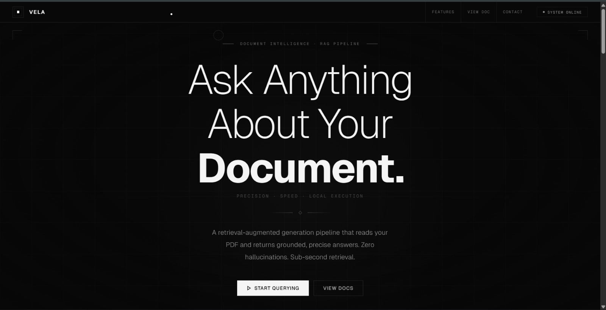
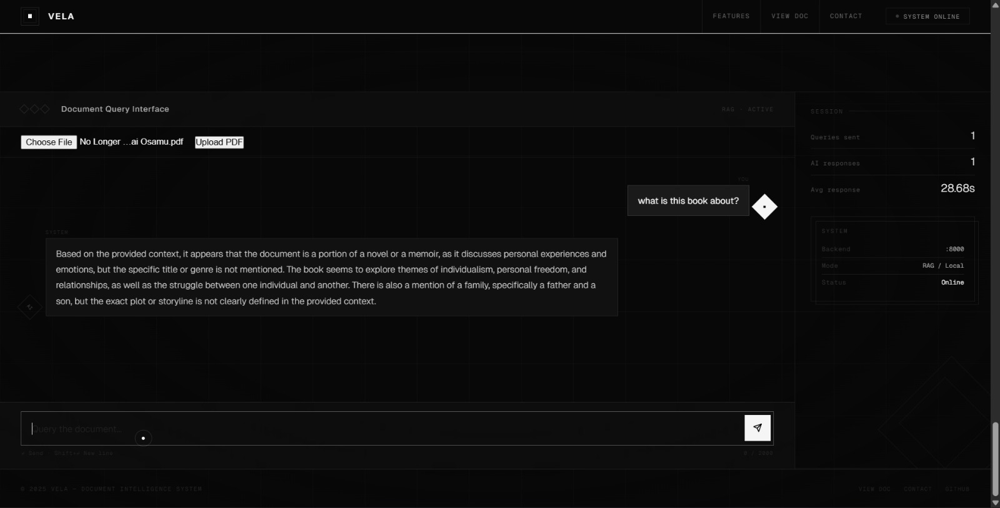

# Simple RAG Document Intelligence

A **Retrieval-Augmented Generation (RAG)** system that allows users to **upload PDF documents and ask questions about them using a local LLM**.

This project combines **FastAPI, LangChain, FAISS, and Ollama (Mistral)** to build a document intelligence system that performs semantic search and generates answers grounded in document content.

---

## Features

* Upload PDF documents
* Ask questions about the document
* Semantic search using FAISS vector database
* Local LLM inference with Ollama (Mistral)
* FastAPI backend API
* Custom frontend interface
* Retrieval-Augmented Generation pipeline

---

## System Architecture

PDF → Text Chunking → Embeddings → FAISS Vector DB → Retrieval → LLM → Answer

---

## Tech Stack

### Backend

* FastAPI
* Python

### AI / ML

* LangChain
* FAISS Vector Database
* HuggingFace Embeddings
* Ollama (Mistral LLM)

### Frontend

* HTML
* CSS
* JavaScript

---

# Demo

## Interface



---

## Querying a Document



---

# Project Structure

```
simple-rag-document-intelligence

frontend
 └── files
      ├── index.html
      ├── docs.html
      └── contact.html

rag_api.py
requirements.txt
test.ipynb

indexpagess.jpeg
interfacess.jpeg
README.md
```

---

# How It Works

1. User uploads a PDF document.
2. Backend extracts text from the document.
3. Text is split into semantic chunks.
4. Each chunk is converted into embeddings.
5. Embeddings are stored in a FAISS vector database.
6. When a question is asked:

   * Relevant chunks are retrieved
   * Context is passed to the LLM
   * The LLM generates an answer grounded in the document.

---

# Running the Project Locally

## Install dependencies

```
pip install -r requirements.txt
```

---

## Start Ollama

Make sure Ollama is installed.

Run:

```
ollama run mistral
```

---

## Start FastAPI backend

```
uvicorn rag_api:app --reload
```

Server runs at:

```
http://127.0.0.1:8000
```

---

## Open the frontend

Open this file in your browser:

```
frontend/files/index.html
```

Upload a PDF and start asking questions.

---

# Example Questions

* Who wrote this document?
* What is this book about?
* Summarize the document
* Explain the main idea of this text

---

# Future Improvements

* Multi-document support
* Page citation for answers
* Better metadata extraction
* Conversational document memory
* Improved UI

---

# Author

Nidhish Poojary

---

# License

MIT License
